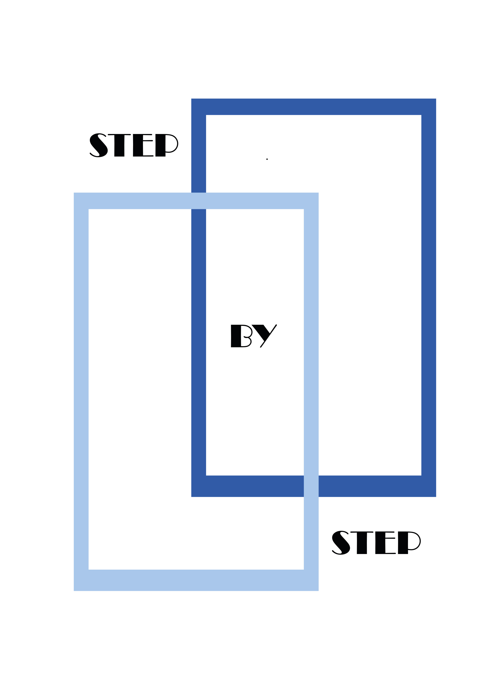

# stepByStep

The basis of a diverse modular Authentication base digital solution to start your web/app enhanced with IA.

# Processes

## 1. Work on Development
    
### Previously

    Start to develop from a ESTABILIZED VERSION
    
    Explanation: 
        
        1. Step By Step RELEASE is associated at the same time with every RELEASED of the repositories involved on the project. 
        
        2. Clone the respective repositories
            
        3. Stablish new branches from RELEASE tags, ( This involves to change package.json references )
            
        4. Start development
        
        RELEASE DATA ASSOCIATED WITH ESTABILIZED VERSION 
        
        [Documentation]( https://hectorserranodelafuente.github.io/get-stepByStep )

    
    WARNING: 
        
        For avoiding technical GIT problems, commits defined on package.json are not targeted by TAG, instead have 
        
        been targeted by COMMIT ( the last commit of the TAG )

### Actions    
    
    ( Action ) Delete node_modules
    
    ( Action ) Update package.json with last plugin commits

    ( Command )  npm install

    ( Command ) npm run integrateTheme

    ( Command ) npm run integrateAPI

    ( Command ) npm run createDbTest ( Non Optional: If we have just cloned the project )

    ( Command ) npm run createDbDev ( Non Optional:, if we have just cloned the project )

    ( Command ) npm run test ( Optional, Recommended when API changes have just released )
    
    ( Command ) npm run setLoading

    ( Action )  fill Configuration files
    
    ( Command ) npm run renderDev

    ( Command ) npm run startDev

    TACHAAAN !! http://localhost:3000/view/loading/loading.html

### 2. Dist generation

    ( Action ) Create db pro file

    ( Command ) npm run createDbPro
    
    ( Command ) npm run pro

    ( Command ) < distFolderPath > / npm install
    
    ( Action )  Configure nginx
    
    ( Command ) < nginxFolder > start nginx
    
    ( Command ) < distFolderPath > node server.js -- environment=production 

### 3. Cordova

    

## Configure email
    
    Modify file env.js

    replace < host >, < user >, < pass >, < from >
    
    transporter:{

        host:<host>,
        
        port:587,
        
        secure:false,
        
        auth:{
            user:<user>,
            pass:<pass>
        },
        
        tls:{
            rejectUnauthorized:false
        }
    },
    mailOptions:{
        
        from:<from>
    
    },

## Configure dbPro
    
    Modify file env.js
    
    Replace <dbPro>
    
    module.exports = {
        
        development:dev,
        
        production:{...dev,dbSqlitePath: <dbPro> },

        test:{...dev,dbSqlitePath:path.join(__dirname,'/db/test/sqlite/dbLoginTest.sqlite')}

    }

## Start server pro
 
    npm run startPro

    http://localhost:3000/view/basic-start

## Config front-end

Modify basicSignUpConfigForm.js